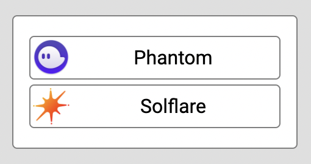
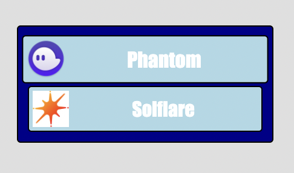

# Angular Sol Wallets
## Library for Web Wallets on Solana Blockchain

<em>

 news on 0.0.19
  <ul>
    <li style="color:darkred">fix: launch wallets only when ask connection</li>
    <li style="color:darkgreen">feat: setEnabledWallets: choose all wallets you want to use. if there is only one wallet enabled, popup will not be displayed.</li>
  </ul>
</em>

 
This library was generated with <a href= "https://github.com/angular/angular-cli">Angular CLI</a> version 12.1.0.

## DESCRIPTION

<h3>
Provide a service for using easily wallets on your web Angular project:

 <em>overview of all features:</em>
 
</h3>
 

 
connect() => Wallet Object
 
disconnect() => boolean
 
signMessage( message : string) => signature (as string)
 
signTransfer( address : string, sols : number) => Buffer
 
signAndSendTransfer( address : string, sols : number, signedByUser? : CallableFunction ) => signature (as string) 
 
signTransaction( transaction : Transaction ) => signature (as string) => signature (as string)
 
 
setCluster( cluster : Cluster ) <em>default = "devnet"</em>
 
setCommitment( commitment : Commitment ) <em>default = "finalized"</em>
 
setEnabledWallets( wallets : AvalableWallets[] )
 
getPublicKey() => PublicKey
  
autoConnect : boolean

 
<h2>
USAGE
</h2>

### 1- Install the library

Open terminal in your Angular project root folder and run: 
 

<pre>npm i --save angular-sol-wallets</pre>

If needed, install the peer dependencies

<pre>npm i --save @solana/web3.js</pre>

You may have to add the global variable in *prolyfills.ts* file 

<pre>
 (window as any)['global'] = window;
</pre>

And add the following allowedCommonJsDependencies in the angular.json **build options** file to disable warnings

<pre>
  "allowedCommonJsDependencies": [
    "@solana/buffer-layout",
    "borsh",
    "bs58",
    "buffer",
    "jayson/lib/client/browser",
    "rpc-websockets",
    "secp256k1",
    "tweetnacl"
  ]
</pre>

### 2- import the module

Example in the AppModule:
 

<pre style="color : gray">
import { NgModule } from '@angular/core';
import { BrowserModule } from '@angular/platform-browser';
<strong style="color : white">import { SolWalletsModule } from 'angular-sol-wallets';</strong>

import { AppRoutingModule } from './app-routing.module';
import { AppComponent } from './app.component';

@NgModule({
declarations: [
    AppComponent
],

imports: [
    BrowserModule,
    AppRoutingModule,
    <strong style="color : white">SolWalletsModule</strong>
],

</pre>

### 3- use **SolWalletsService** in a component

Example in the appComponent:
 *the functions in the component are called buy a click event in the html template*

<pre style="color : gray" >...
import { SolWalletsService, Wallet } from "angular-sol-wallets" ;
...
export class AppComponent {
  constructor(
    private httpClient : HttpClient,
    private solWalletS : SolWalletsService
    ){}

  connect(){
    this.solWalletS.connect().then( wallet => {
      console.log("Wallet connected successfully with this address:", wallet.publicKey);
    }).catch(err => {
      console.log("Error connecting wallet", err );
    })
  }
  disconnect(){
    this.solWalletS.disconnect();
  }
  signMessage(){
     this.solWalletS.signMessage("HELLO WORLD!").then( signature => {
      console.log('Message signed:', signature);
    }).catch( err => {
      console.log('err transaction', err );
    })
  }
  makeATransfer( myCompanyPublicKey : string, solAmmount : number){
    this.solWalletS.signAndSendTransfer(myCompanyPublicKey, solAmmount ).then( signature => {
      console.log('Transfer successfully opered:', signature);
    }).catch( err => {
      console.log('Error transaction', err );
    });
  }
  sendTransferToServer( myCompanyPublicKey : string, solAmmount : number){
    this.solWalletS.signTransfer(myCompanyPublicKey, solAmmount, signedByUserCallback => {
        //Do something like puting a loading popup during solana's transfer verification
    }).then( buffer => {
        this.httpClient.post('https://myserver.io/myAPI/makeTransfer', { transferRow : buffer }).subscribe( res => {
          console.log('Transfer successfully opered:', res.signature);
        });
    }).catch( err => {
      console.log('Error transaction', err );
    });
    httpClient
  }
</pre>

### 4- options / parameters
<borld>Autoconnect:</bold>
 Set autoconnect as true on WalletsService make the last wallet used by the client automatically re-connected
 (this avoid the user to have to choose again a wallet when making actions with service)
 Example of usage in the App constructor :
<pre><code>
  constructor(
    private solWalletS : SolWalletsService
    ){
      this.solWalletS.autoConnect = true ;
      this.solWalletS.wallet.subscribe( wallet => {
        console.log('the last wallet used by the client is automatically connected without any actions.' );
      })
  }
</code></pre>

<borld>SetEnabledWallets:</bold>
 Choose the wallets you want to use.
 By default all the wallets are enabled.
<pre><code>
  constructor(
    private solWalletS : SolWalletsService
    ){
      this.solWalletS.setEnabledWallets(["Phantom"]);
  }
</code></pre>

### 5- customize 
You can customize the style of the popup, like so: 
 

 
<pre>
  constructor(
    private solWalletS : SolWalletsService
    ){
      this.solWalletS.setCustomClasses({ 
        background : "myBcg",
        card : "myCard",
        wallets : "myWallets"
      });
</pre>
 
the css: 
<pre>
.myCard{
    font-family: Impact ;
    background-color: darkblue ;
    border : 1px solid black ;
    border-radius: 3px ;    
    color : white ;
    padding : 5px ;
    min-width: 200px ;
}
.myWallets{
    display : flex ;
    flex-flow: row nowrap ;
    background-color: lightblue ;
    border : 1px solid black ;
    border-radius: 3px ;
    margin : 3px ;
    padding : 3px ;
    align-items : center ;
    justify-content: center ;
    cursor : pointer ;
    transition : 0.5s ;
}
.myWallets:hover{
    transform : scale(1.05,1.05);
}
.myBcg{
    background-color: rgba(255,255,255,0.75) !important ;
}
</pre>

### 6- production
sol-wallet use **devnet** Cluster by default
In production you can use the **mainnet-beta** like this exemple in the appComponent:
<pre>
  constructor(
    private solWalletS : SolWalletsService
    ){
      solWalletS.setCluster("mainnet-beta");
</pre>
